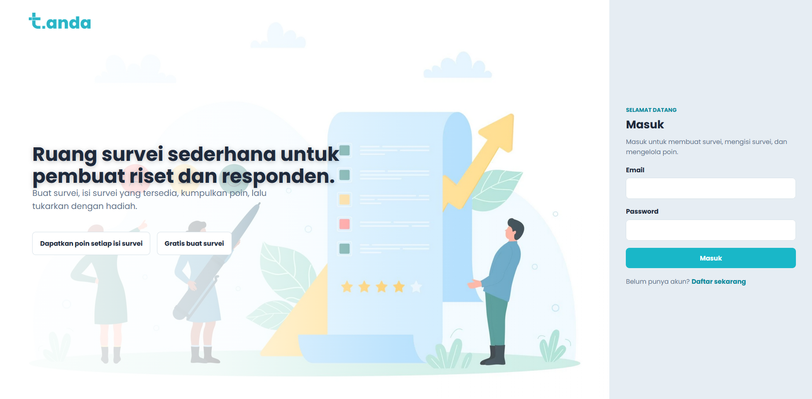
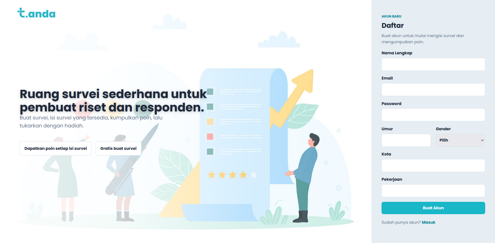
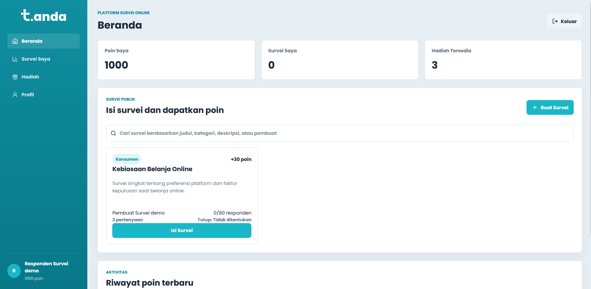
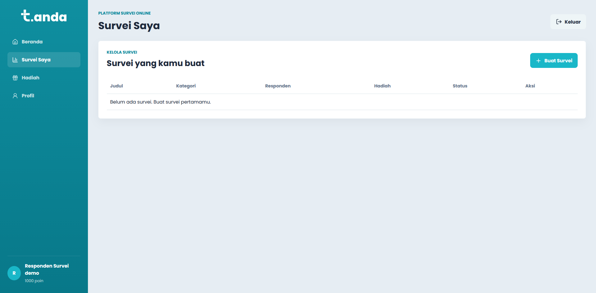
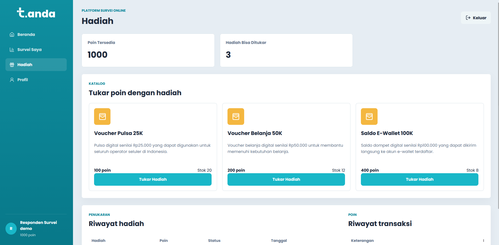
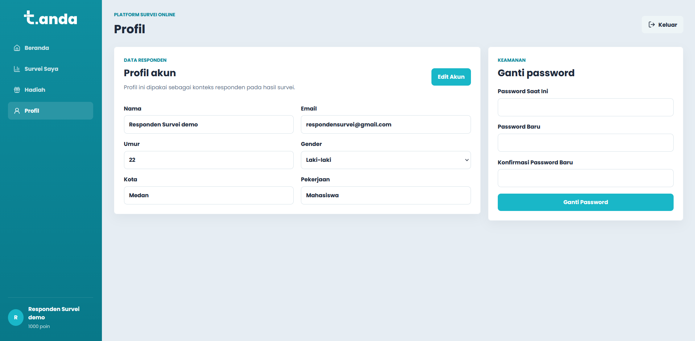
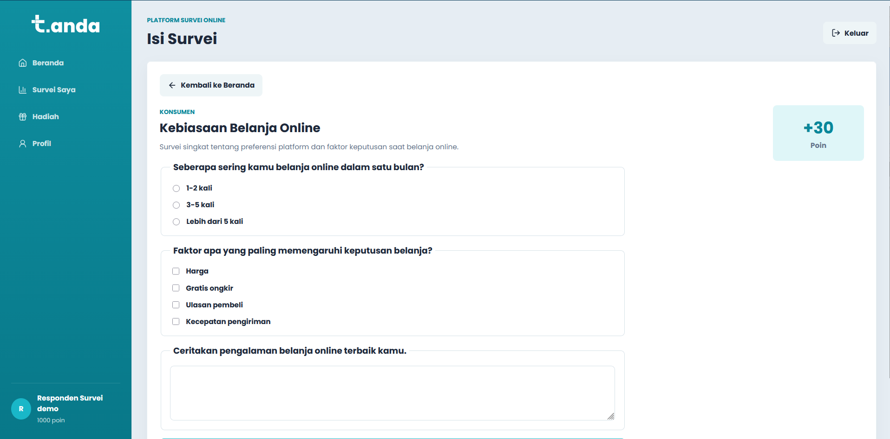
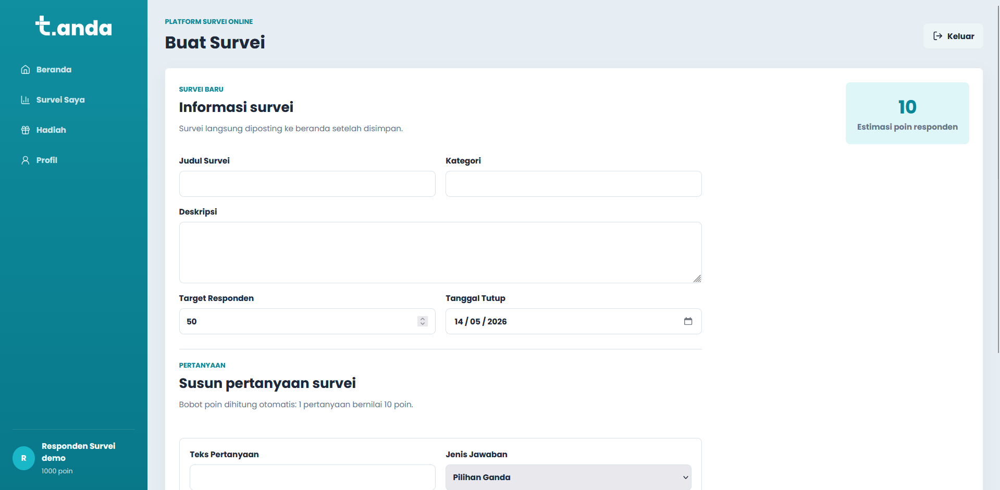

# t.anda — Platform Survei Online

t.anda (tanggapan anda) adalah aplikasi survei online sederhana yang dirancang untuk membantu pengguna membuat survei, mengisi survei, mengumpulkan poin, dan menukarkan poin menjadi hadiah.  


---

## ✨ Fitur Utama

- 🔐 Login & Registrasi akun
- 📋 Membuat survei
- 📝 Mengisi survei publik
- 🎯 Sistem poin responden
- 🎁 Penukaran hadiah / reward
- 👤 Pengelolaan profil pengguna
- 📊 Riwayat aktivitas dan transaksi

---

# 📸 Tampilan Antarmuka

## Halaman Login



---

## Halaman Registrasi



---

## Beranda



---

## Survei Saya



---

## Halaman Hadiah



---

## Halaman Profil



---

## Isi Survei



---

## Buat Survei



---

# 🚀 Menjalankan Project

## 1. Clone Repository

```bash
git clone <repository-url>
```

---

## 2. Install Dependency

```bash
npm install
```

---

## 3. Jalankan Development Server

```bash
npm run dev
```

---

## 4. Build Production

```bash
npm run build
```

---

## 5. Preview Production Build

```bash
npm run preview
```

---

# 👥 Tim Pengembang

- Dimas Parianto                   - 243303611308
- Mike Okten Imanuel Tampubolon    - 243303611329
- Brema Misael Tarigan             - 243303611318
- Jonathan Sianipar                - 243303611257
- Ricky Rivaldo Manik              - 243303612336


---

# 📌 Catatan

Project ini menggunakan data dummy dan local storage browser sebagai media penyimpanan sementara.  
Seluruh data akan tersimpan di browser pengguna dan tidak menggunakan backend/database online.

---

# 🌿 t.anda

> “Buat survei, isi survei, kumpulkan poin, dan tukarkan dengan hadiah.”
